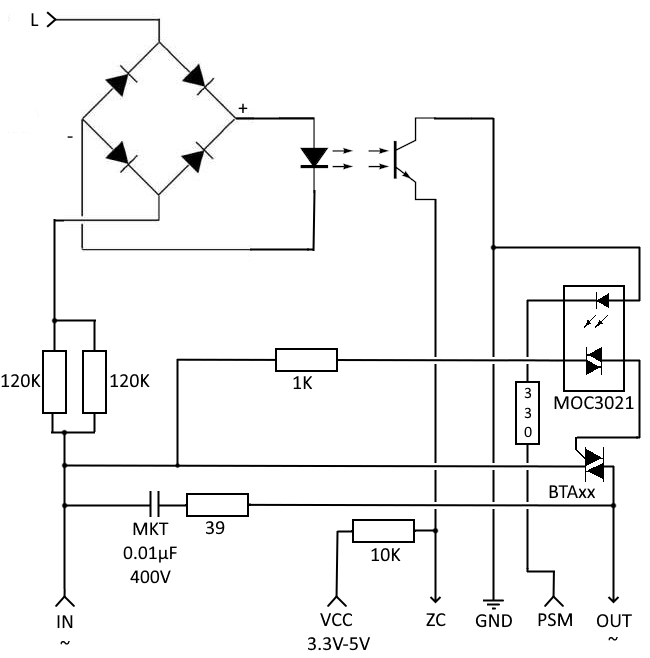

# Rust crate for RdbDimmer

## What is RdbDimmer?

RdbDimmer is device allow dim power of load. Device use a MOC3021 (no zero-crossing detection).

You can visit [RobotDyn Official Store](https://robotdyn.fr.aliexpress.com/store/1950989) or [Official Web site](https://robotdyn.com).




## Compatibility hardware

This crate works only on ESP32-WROOM-32 (2016) microcontroler.

## ESP SKK config

You need add in your `sdkconfig.defaults` file (at root of your rust project):
```
CONFIG_ESP_TIMER_SUPPORTS_ISR_DISPATCH_METHOD=y
CONFIG_ESP_TIMER_INTERRUPT_LEVEL=1
```

## Example

```rust
unsafe {
    let zero_crossing_pin: PinDriver<'static, AnyInputPin, Input> = PinDriver::input(AnyInputPin::new(2)).unwrap();
    let d0_pin: PinDriver<'static, AnyOutputPin, Output> = PinDriver::output(AnyOutputPin::new(4)).unwrap();
    let mut d = DimmerDevice::new(0, d0_pin);
    d.set_power(10);

    // Create Power management
    let ddm = DevicesDimmerManager::init(DevicesDimmerManagerConfig::default_50_hz(zero_crossing_pin, vec![d])).unwrap();

    loop {
        let _ = ddm.wait_zero_crossing();
    }
```

That's all!

## Example for zero-crossing sub-module

```rust
// PsmPin abstract to manage Dimmer
pub struct PsmPin<'a, T>
where
    T: OutputPin,
{
    // The pin to turn on/off
    psm: PinDriver<'a, T, Output>,
}

impl<'a, T> PsmPin<'a, T>
where
    T: OutputPin,
{
    pub fn new(psm: PinDriver<'a, T, Output>) -> Self {
        Self { psm }
    }
}

impl<'a, T> rbd_dimmer::OutputPin for PsmPin<'a, T>
where
    T: OutputPin,
{
    fn set_high(&mut self) -> Result<(), RbdDimmerError> {
        match self.psm.set_high() {
            Ok(_) => Ok(()),
            Err(_) => Err(RbdDimmerError::from(RbdDimmerErrorKind::SetHigh)),
        }
    }

    fn set_low(&mut self) -> Result<(), RbdDimmerError> {
        match self.psm.set_low() {
            Ok(_) => Ok(()),
            Err(_) => Err(RbdDimmerError::from(RbdDimmerErrorKind::SetLow)),
        }
    }
}

// Zero cross pin
pub struct ZeroCrossPin<'a, T>
where
    T: InputPin,
{
    // The pin to turn on/off
    zc: PinDriver<'a, T, Input>,
}

impl<'a, T> ZeroCrossingPin for ZeroCrossPin<'a, T>
where
    T: InputPin,
{
    fn wait_for_rising_edge(&mut self) -> Result<(), RbdDimmerError> {
        let a = block_on(self.zc.wait_for_rising_edge());
        match a {
            Ok(_) => Ok(()),
            Err(_) => Err(RbdDimmerError::other(String::from(
                "Fail to wait signal on Zero Cross pin",
            ))),
        }
    }
}

impl<'a, T> ZeroCrossPin<'a, T>
where
    T: InputPin,
{
    pub fn new(zc: PinDriver<'a, T, Input>) -> Self {
        Self { zc }
    }
}

// This function create all you need.
pub fn new<'a>(
    zc_pin: impl Peripheral<P = impl InputPin> + 'a,
    dimmer_pin: impl Peripheral<P = impl OutputPin> + 'a,
) -> DevicesDimmerManager<PsmPin<'a, impl OutputPin>, ZeroCrossPin<'a, impl InputPin>> {
    let psm_dimmer1 = PsmPin::new(PinDriver::output(dimmer_pin).unwrap());
    let zc = ZeroCrossPin::new(PinDriver::input(zc_pin).unwrap());

    let dim_device = DimmerDevice::new(0, psm_dimmer1);

    let mut devices_dimmer_manager = DevicesDimmerManager::new(zc);

    // Add the device
    devices_dimmer_manager.add(dim_device);

    devices_dimmer_manager
}
```

# More information

Read [How it works?](doc/HOW-IT-WORKS.md) for more information.

## License

The code is released under MIT License to allow every body to use it in all conditions. If you love open-source software and this crate, please give some money to [HaikuOS](https://haiku-os.org/) or [ReactOS](https://reactos.org).
