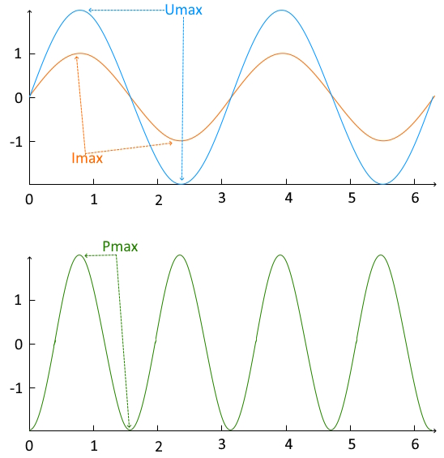
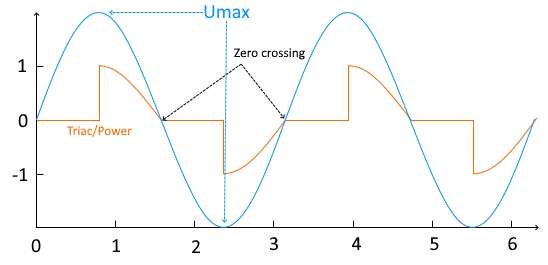

# How it works?

## AC voltage and current

AC power in a purely resistive circuit:



## RMS voltage, current and power

When you read the characteristics of a load, you see V=230V, In=10A, P=1800W for example.

These values are not max values but RMS values. Max value is RMS value multiplied by square root of 2.

## Theorie of manage

To manage power (for example, you want use 50%, 900W, in previous example), we will turn on power only on half sinusoidal.

To do that, with ESP32, we use ISR timer (timer callback run directly in RAM). The timer value is half sinusoidal period (10ms in 50Hz) and cut in 100 parts.

That mean, ISR timer run on evey 0.1ms (0.083ms for 60Hz).

Another thread need to check if zero crossing happen. If that, a internal counter (named TICK) will be reset to 0 value.

If TICK have value between 0 to 100, our ISR timer check how many percent we want and turn on when happen.

Remember that ISR timer is not syncrhonized with zero crossing detection (cause performance issue when turn on/of ISR timer every 10ms).



## Example with 60W load

```
Power % = 50
Power1: 33.201

Power % = 49
Power1: 32.1727

Power % = 48
Power1: 30.917

Power % = 47
Power1: 29.952799

Power % = 46
Power1: 28.661999

Power % = 45
Power1: 27.5635

Power % = 44
Power1: 26.372099

Power % = 43
Power1: 25.1873

Power % = 42
Power1: 23.967499

Power % = 41
Power1: 22.7494

Power % = 40
Power1: 21.5064

Power % = 39
Power1: 20.1313

Power % = 38
Power1: 19.2342

Power % = 37
Power1: 18.0105

Power % = 36
Power1: 16.991999

Power % = 35
Power1: 15.8699

Power % = 34
Power1: 14.859699

Power % = 33
Power1: 13.8748

Power % = 32
Power1: 12.8608

Power % = 31
Power1: 11.9963

Power % = 30
Power1: 11.0848

Power % = 29
Power1: 10.2

Power % = 28
Power1: 9.243899

Power % = 27
Power1: 8.3814

Power % = 26
Power1: 7.7672997

Power % = 25
Power1: 7.0985

Power % = 24
Power1: 6.3708

Power % = 23
Power1: 5.7089

Power % = 22
Power1: 5.0558

Power % = 21
Power1: 4.5273

Power % = 20
Power1: 4.0347

Power % = 19
Power1: 3.5386

Power % = 18
Power1: 3.119

Power % = 17
Power1: 2.7021

Power % = 16
Power1: 2.3260999

Power % = 15
Power1: 1.9713

Power % = 14
Power1: 1.6458

Power % = 13
Power1: 1.3488

Power % = 12
Power1: 1.1142

Power % = 11
Power1: 0.9051

Power % = 10
Power1: 0.6644

Power % = 9
Power1: 0

Power % = 8
Power1: 0
```
